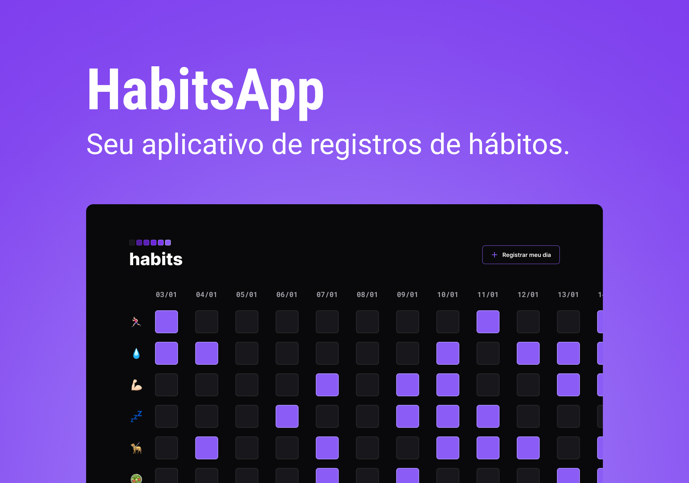

<h1 align="center"> HabitsApp </h1>

O Habits é um aplicativo que ajuda as pessoas a registrar e monitorar seus hábitos diários. Ele permite que os usuários registrem seus hábitos e acompanhem seu progresso, ajudando-os a desenvolver hábitos saudáveis e alcançar seus objetivos. 

  <a href="#-tecnologias">Tecnologias</a>&nbsp;&nbsp;&nbsp;|&nbsp;&nbsp;&nbsp;
  <a href="#-projeto">Projeto</a>&nbsp;&nbsp;&nbsp;|&nbsp;&nbsp;&nbsp;
  <a href="#-layout">Layout</a>&nbsp;&nbsp;&nbsp;|&nbsp;&nbsp;&nbsp;
  <a href="#memo-licença">Licença</a>

  

 

  

## 🚀 Tecnologias

Esse projeto foi desenvolvido com as seguintes tecnologias:

- HTML e CSS
- JavaScript
- Git e Github
- Figma

## 💻 Projeto

O aplicativo Habits ajuda a rastrear e monitorar os hábitos.

## 🔖 Layout

Você pode visualizar o layout do projeto através [DESSE LINK](https://www.figma.com/file/smNI5kzdXWFiLKyria4XtH/HabitsApp?t=7tjjH1vEJ2RUdGJ9-1). É necessário ter conta no [Figma](https://figma.com) para acessá-lo.

## :memo: Licença

Esse projeto está sob a licença MIT.

---

Feito com ♥ by Rocketseat :wave: [Participe da nossa comunidade!](https://discord.gg/rocketseat)
